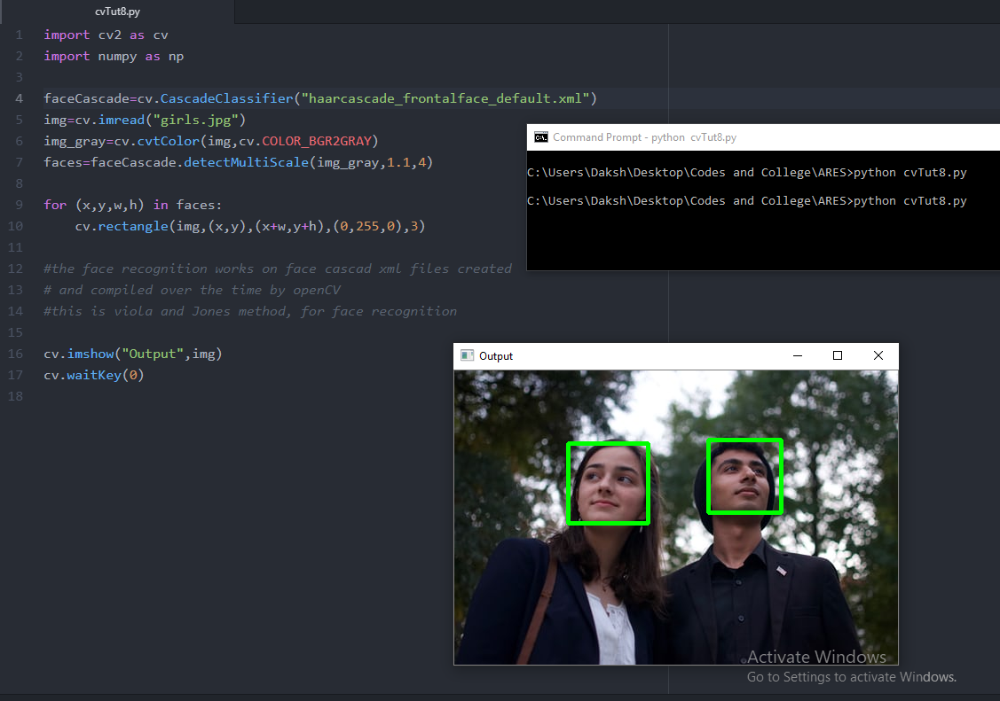

# face-detection-software
This is a general, Harr cascade, frontal face default face detector made with OpenCV and python. The harr cascade frontalface default xml file is taken from openCV documentation. 

Credits for the image-unsplash.com(Milo Bauman)(https://unsplash.com/photos/21gf46pBe6E)

the output of the complete program is shown in the image below

